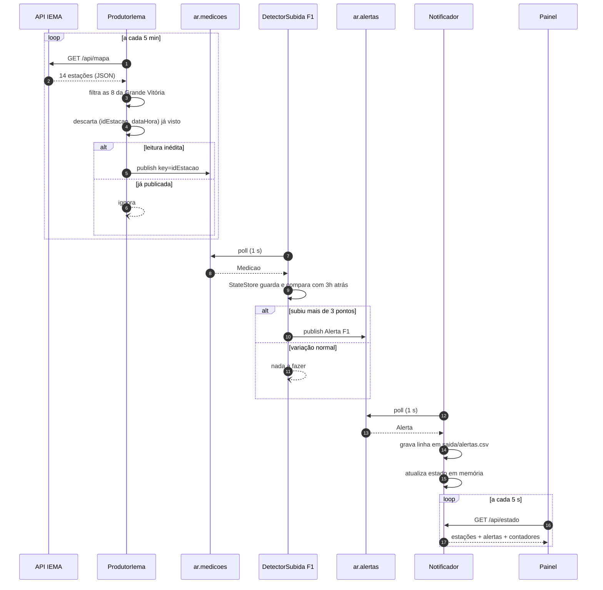
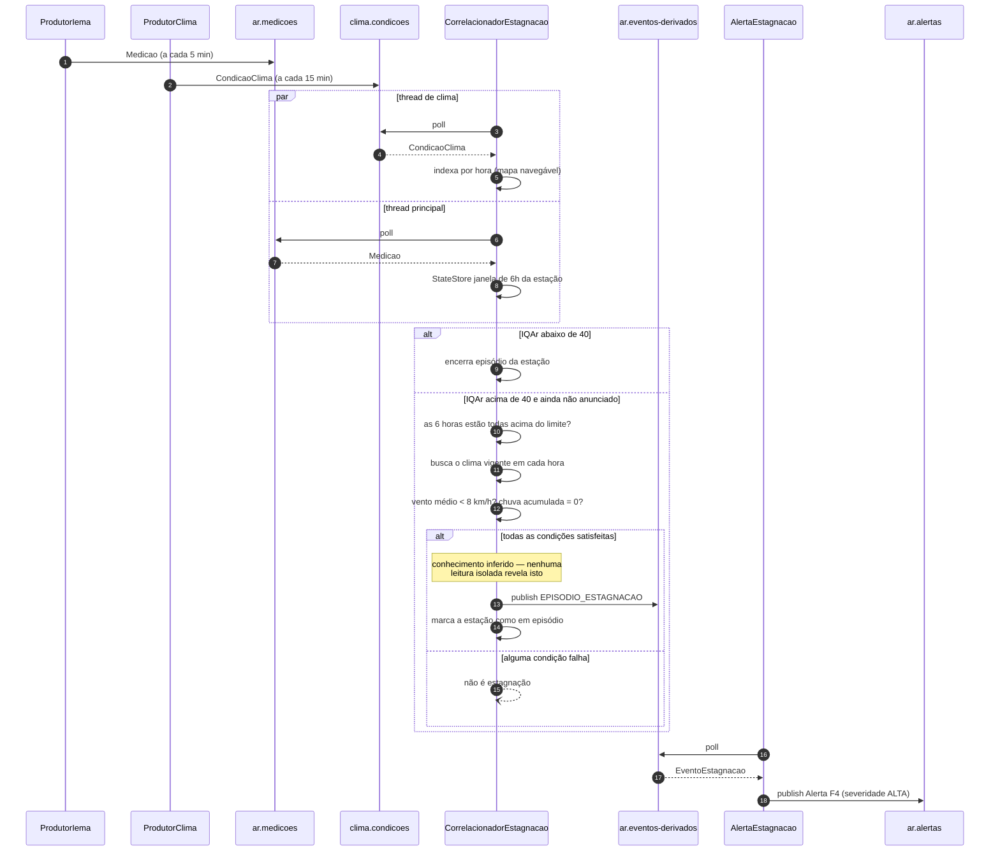

# Monitoramento da Qualidade do Ar da Grande Vitória

Projeto 1 · Sistemas Orientados a Eventos · UFES · entrega 28/09/2026

Sistema de monitoramento orientado a eventos sobre Apache Kafka, alimentado pela
API pública de qualidade do ar do **IEMA-ES** e pelo **Open-Meteo**.

- Requisitos do enunciado: [PROJETO1-RESUMO.md](PROJETO1-RESUMO.md)
- Projeto detalhado e calibração: [PROJETO1-PROPOSTA.md](PROJETO1-PROPOSTA.md)
- Material da disciplina: [TEORIA-RESUMO.md](TEORIA-RESUMO.md)

## Como funciona

O sistema acompanha continuamente a qualidade do ar de oito estações da Grande
Vitória. Ele coleta leituras de duas APIs públicas, publica cada leitura como um
**evento primitivo** no Kafka, e mantém consumidores independentes vigiando esse
fluxo. Quando um deles reconhece uma **situação de interesse**, emite um alerta.
Um quinto componente vai além: correlaciona duas fontes ao longo de uma janela de
seis horas para **inferir** um episódio que nenhuma leitura isolada revelaria, e
devolve esse conhecimento ao Kafka como um **evento derivado**.

### O fluxo

```
   FONTES EXTERNAS                PRODUTORES                    KAFKA
   ───────────────                ──────────         (3 brokers, KRaft, replicação 3)

┌──────────────────────┐
│  IEMA — Governo ES   │  HTTP    ┌──────────────────┐
│ qualidadedoarapi     │◀─────────│  ProdutorIema    │──────▶ ┌────────────────────┐
│   .es.gov.br         │  5 min   │ deduplica por    │        │   ar.medicoes      │
│                      │          │ (id, dataHora)   │        │ 3 part · chave=id  │
│ 8 estações · 1×/hora │          └──────────────────┘        └─────────┬──────────┘
└──────────────────────┘                                                │
                                                                        │
┌──────────────────────┐                                                │
│     Open-Meteo       │  HTTP    ┌──────────────────┐                  │
│  api.open-meteo.com  │◀─────────│  ProdutorClima   │──────▶ ┌─────────▼──────────┐
│                      │  15 min  └──────────────────┘        │  clima.condicoes   │
│ vento e chuva        │                                      │ 1 part · ordem     │
│ atualiza a cada 15min│                                      │       total        │
└──────────────────────┘                                      └─────────┬──────────┘
                                                                        │
   ┌────────────────────────────────────────────────────────────────────┤
   │                    │                    │                          │
   ▼                    ▼                    ▼                          ▼
┌─────────┐      ┌─────────────┐     ┌──────────────┐   ┌───────────────────────────┐
│   F1    │      │     F2      │     │      F3      │   │  F4 Correlacionador       │
│ subida  │      │   faixa     │     │   estação    │   │     Estagnação            │
│ > 3 pts │      │ piorou de   │     │   offline    │   │  janela de 6h sobre       │
│  em 3h  │      │   faixa     │     │  > 2h sem    │   │  AS DUAS fontes           │
│         │      │             │     │   medição    │   │  CONSUMIDOR + PRODUTOR    │
└────┬────┘      └──────┬──────┘     └──────┬───────┘   └─────────────┬─────────────┘
     │                  │                   │                         │
     │                  │                   │                         ▼
     │                  │                   │           ┌───────────────────────────┐
     │                  │                   │           │   ar.eventos-derivados    │
     │                  │                   │           │   EPISODIO_ESTAGNACAO     │
     │                  │                   │           └─────────────┬─────────────┘
     │                  │                   │                         ▼
     │                  │                   │           ┌───────────────────────────┐
     │                  │                   │           │     AlertaEstagnacao      │
     │                  │                   │           └─────────────┬─────────────┘
     │                  │                   │                         │
     └──────────────────┴───────────────────┴─────────────────────────┘
                                     │
                                     ▼
                        ┌────────────────────────┐
                        │      ar.alertas        │
                        └───────────┬────────────┘
                                    ▼
                        ┌────────────────────────┐
                        │      Notificador       │
                        └──┬──────────────────┬──┘
                           │                  │
                  saida/alertas.csv    http://localhost:8080
                    (planilha)            (painel web)
```

### De quanto em quanto tempo

| Etapa | Frequência | Por quê |
|---|---|---|
| Estação do IEMA publica | **1× por hora** | é o teto real do sistema; não controlamos |
| Open-Meteo publica | **a cada 15 min** | — |
| `ProdutorIema` consulta | **5 min** | reduz a latência de detecção |
| `ProdutorClima` consulta | **15 min** | acompanha a fonte |
| Detectores fazem `poll` | **1 s** | tempo máximo de espera, não de reação |
| Painel busca `/api/estado` | **5 s** | — |

O `ProdutorIema` consulta 12× por hora um dado que muda 1× por hora. É de propósito:
assim a leitura das 14h, publicada por volta das 14h02, é detectada em no máximo
cinco minutos, e não na hora seguinte. O custo seriam onze eventos repetidos por
hora por estação — é o que o registro de deduplicação evita, publicando apenas
quando o par `(idEstacao, dataHoraMedicao)` é inédito.

### Latência de ponta a ponta

```
estação mede            14:00
IEMA publica na API     ~14:02
ProdutorIema detecta    até 5 min depois        ← quase toda a espera está aqui
Kafka entrega           milissegundos
detector avalia         milissegundos
painel mostra           até 5 s depois
```

Na prática, **2 a 7 minutos** entre a medição existir na API e o alerta aparecer na
tela.

### As APIs

Ambas são públicas, sem chave e sem cadastro. Abrem direto no navegador.

| | Endpoint |
|---|---|
| Snapshot das estações | `https://qualidadedoarapi.es.gov.br/api/mapa` |
| Histórico de ~48h de uma estação | `https://qualidadedoarapi.es.gov.br/api/mapa/{id}` |
| Vento e chuva | `https://api.open-meteo.com/v1/forecast?latitude=-20.3155&longitude=-40.3128&current=precipitation,wind_speed_10m,wind_direction_10m` |

As oito estações da Grande Vitória:

| Id | Estação | Município | Id | Estação | Município |
|---|---|---|---|---|---|
| 1 | Laranjeiras | Serra | 5 | Vitória - Centro | Vitória |
| 2 | Carapina | Serra | 6 | Vila Velha - IBES | Vila Velha |
| 3 | Jardim Camburi | Vitória | 8 | Vila Capixaba | Cariacica |
| 4 | Enseada do Suá | Vitória | 9 | Cidade Continental | Serra |

A API expõe 14 estações no total; as outras seis pertencem à rede de Anchieta e
Guarapari e são filtradas na coleta.

> Todos os intervalos acima estão em `src/main/resources/config.properties` e podem
> ser mudados sem recompilar, com `-Dchave=valor`. Por exemplo, para acelerar a
> coleta numa demonstração ao vivo:
> ```bash
> java -Diema.intervalo.segundos=60 -cp target/monitoramento-ar.jar br.ufes.soe.ar.produtor.ProdutorIema
> ```

## Pré-requisitos

| | Versão | Observação |
|---|---|---|
| JDK | 21 (Temurin) | exigido pelo `kafka-clients` 4.x |
| Maven | 3.9+ | mesmas dependências do Lab2 |
| Docker Desktop | — | sobe o cluster Kafka |

## 1. Subir o cluster

Três brokers em KRaft, com as portas do Lab1 (9092/9094/9096 para brokers,
9093/9095/9097 para controllers). Os quatro tópicos são criados automaticamente.

```bash
docker compose up -d
docker compose ps
```

Painel do cluster (tópicos, partições, offsets, consumer groups):
**http://localhost:8081**

## 2. Compilar

```bash
mvn package
```

Gera `target/monitoramento-ar.jar` com as dependências embutidas.

## 3. Executar

Cada componente é um `main` independente, rodando em seu próprio terminal.

```bash
# Produtores
java -cp target/monitoramento-ar.jar br.ufes.soe.ar.produtor.ProdutorIema
java -cp target/monitoramento-ar.jar br.ufes.soe.ar.produtor.ProdutorClima

# Detectores (as situações de interesse)
java -cp target/monitoramento-ar.jar br.ufes.soe.ar.consumidor.DetectorSubida
java -cp target/monitoramento-ar.jar br.ufes.soe.ar.consumidor.DetectorFaixa
java -cp target/monitoramento-ar.jar br.ufes.soe.ar.consumidor.DetectorSensor

# F4: o evento derivado, e o consumidor que o transforma em alerta
java -cp target/monitoramento-ar.jar br.ufes.soe.ar.consumidor.CorrelacionadorEstagnacao
java -cp target/monitoramento-ar.jar br.ufes.soe.ar.consumidor.AlertaEstagnacao

# Notificador: grava o CSV e serve o painel web
java -cp target/monitoramento-ar.jar br.ufes.soe.ar.consumidor.Notificador
```

Com o notificador de pé:

| | |
|---|---|
| Painel do projeto | **http://localhost:8080** |
| Estado em JSON | http://localhost:8080/api/estado |
| Planilha de alertas | `saida/alertas.csv` |

No Windows, acrescente `-Dstdout.encoding=UTF-8` para os acentos saírem corretos no
console. Os dados gravados no Kafka já são UTF-8 — o problema é só a página de código
do terminal.

### Reprocessar do início

Por padrão cada detector guarda seu offset e continua de onde parou. Para reprocessar
o tópico inteiro, use um consumer group novo:

```bash
java -Dgrupo.novo=1 -cp target/monitoramento-ar.jar br.ufes.soe.ar.consumidor.DetectorSubida
```

### Replay para a apresentação

Reproduz as ~48h de histórico real em escala acelerada. Sem isso, uma demonstração de
vinte minutos não veria alerta nenhum: as estações reportam uma vez por hora e quase
sempre estão na faixa "Boa".

```bash
# estações 3 e 4, cada hora real vira 300 ms
java -cp target/monitoramento-ar.jar br.ufes.soe.ar.produtor.ProdutorReplay 3,4 300

# todas as estações, 1 hora = 1 segundo
java -cp target/monitoramento-ar.jar br.ufes.soe.ar.produtor.ProdutorReplay todas 1000
```

> **Recomendado:** rode o replay num tópico limpo. Misturar leituras ao vivo (de hoje)
> com histórico (de dois dias atrás) no mesmo tópico cria uma linha do tempo que anda
> para trás. Os detectores lidam com isso — detectam o salto e reiniciam a série —
> mas a leitura do log fica bem mais clara sem a mistura:
>
> ```bash
> docker compose down -v && docker compose up -d
> ```

## Situações de interesse

O enunciado pede no mínimo **três situações sobre eventos primitivos** mais **uma
situação complexa com evento derivado**, e dá como exemplo o monitoramento de câmaras
de vacina, com um alerta antecipado e um evento por persistência. As quatro abaixo
seguem essa estrutura.

| | Situação | Tipo | Componente |
|---|---|---|---|
| **F1** | Piora acelerada | primitivo | `DetectorSubida` |
| **F2** | Ultrapassagem de faixa | primitivo | `DetectorFaixa` |
| **F3** | Estação fora de operação | primitivo | `DetectorSensor` |
| **F4** | Episódio de estagnação | **derivado** | `CorrelacionadorEstagnacao` + `AlertaEstagnacao` |

### F1 — Piora acelerada da qualidade do ar

> Caso o IQAr de uma estação **suba mais de 3 pontos em 3 horas**, o sistema deve
> notificar os gestores ambientais informando a estação, o poluente crítico, o valor
> atual e a variação observada.

**Ação:** alerta de severidade MÉDIA em `ar.alertas`.

Mede tendência, não nível. Cada estação tem uma linha de base própria — a mediana vai
de 3,4 em Laranjeiras a 53,3 na Enseada do Suá — então um limiar absoluto baixo
dispararia sem parar numa e nunca na outra. A subida rápida é comparável entre todas.

### F2 — Ultrapassagem da faixa de qualidade

> Caso o IQAr de uma estação **ultrapasse 40 e mude de faixa**, o sistema deve emitir
> alerta à população da região com a nova faixa e a recomendação de saúde
> correspondente.

**Ação:** alerta em `ar.alertas`; severidade ALTA a partir da faixa "Ruim".

A classificação vem do campo `Faixa` que a própria API do IEMA devolve, e não de uma
reimplementação da escala — assim o sistema acompanha sozinho qualquer revisão do
índice pelo órgão.

### F3 — Estação fora de operação

> Caso uma estação **deixe de reportar medições válidas por mais de 2 horas**, o
> sistema deve emitir alerta de manutenção e marcar a estação como indisponível, para
> que o silêncio não seja interpretado como ausência de poluição.

**Ação:** alerta de manutenção; a estação é marcada indisponível para F4.

Não é uma situação hipotética: a estação RGV2 (Carapina) está fora do ar, devolvendo
`"Poluente": null` e a data sentinela `0001-01-01T00:00:00`. Repare na inversão em
relação às outras funcionalidades — aqui o que interessa é a **ausência** de
informação. Num sistema de monitoramento, tratar silêncio como "tudo bem" é o erro
mais perigoso que existe.

### F4 — Episódio de estagnação atmosférica *(evento derivado)*

> Caso o IQAr de uma estação **permaneça acima de 40 por 6 horas consecutivas, sob
> vento médio abaixo de 8 km/h e sem chuva**, o sistema deve inferir um episódio de
> estagnação atmosférica, publicar esse evento derivado no Kafka e recomendar
> restrição de atividades ao ar livre na região.

**Entradas:** `ar.medicoes` **e** `clima.condicoes`
**Ação:** publica `EPISODIO_ESTAGNACAO` em `ar.eventos-derivados`; um segundo
consumidor lê esse tópico e emite alerta de severidade ALTA.

É aqui que o sistema **infere conhecimento**. Um IQAr de 55 às 3h da manhã é apenas um
número. O episódio só existe na conjunção de três coisas que vivem em eventos
diferentes: persistência temporal (seis horas seguidas acima do limite), condição
meteorológica que permite acúmulo (vento fraco) e ausência de remoção por chuva. O
evento derivado carrega essa síntese pronta, e quem o consome não precisa refazer o
raciocínio.

É também o componente que atende à exigência de um **consumidor que exerce o papel de
produtor**.

---

Os limiares estão em `src/main/resources/config.properties` e podem ser sobrescritos
na linha de comando com `-Dchave=valor`, sem recompilar. A calibração que os originou,
feita sobre 48 horas reais da rede, está na seção 7.5 da proposta.

## Diagramas de sequência

### Evento primitivo até o alerta

Percurso de uma leitura comum, de F1 a F3. O tempo todo o Kafka é o único meio de
comunicação entre os componentes — nenhum deles chama o outro diretamente.



### Evento derivado (F4)

Aqui entram as duas fontes e a janela de seis horas. O correlacionador aparece com
duas setas de entrada e uma de saída — é o que caracteriza o consumidor que também
produz.



> Os diagramas usam Mermaid, que o GitHub renderiza direto no README. Para visualizar
> localmente, o VS Code tem a extensão *Markdown Preview Mermaid Support*, ou cole o
> bloco em <https://mermaid.live>.

## Tópicos

| Tópico | Chave | Partições | Replicação |
|---|---|---|---|
| `ar.medicoes` | `idEstacao` | 3 | 3 |
| `clima.condicoes` | fixa | 1 | 3 |
| `ar.eventos-derivados` | `idEstacao` | 3 | 3 |
| `ar.alertas` | tipo do alerta | 3 | 3 |

Chavear por `idEstacao` aplica a partição semântica da Aula 4: toda leitura de uma
estação cai na mesma partição e, portanto, chega em ordem — do que dependem as regras
de janela temporal de F1 e F4.

## Estrutura

```
src/main/java/br/ufes/soe/ar/
├── modelo/        Medicao, CondicaoClima, Alerta, EventoEstagnacao, Faixa
├── serde/         JsonSerializer / JsonDeserializer (padrão do Lab2, genérico)
├── infra/         clientes HTTP das APIs, config, tópicos, estações
├── produtor/      ProdutorIema, ProdutorClima, ProdutorReplay
└── consumidor/    os detectores, o StateStore e as fábricas Kafka
```

## Estado atual

| Componente | Situação |
|---|---|
| Cluster, tópicos e Kafka UI | pronto |
| `ProdutorIema` (com deduplicação persistente) | pronto |
| `ProdutorClima` | pronto |
| `ProdutorReplay` | pronto |
| F1 `DetectorSubida` | pronto e verificado |
| F2 `DetectorFaixa` | pronto — ver ressalva abaixo |
| F3 `DetectorSensor` | pronto e verificado |
| F4 `CorrelacionadorEstagnacao` | pronto e verificado |
| `AlertaEstagnacao` (derivado -> alerta) | pronto e verificado |
| `Notificador` (CSV + painel HTTP) | pronto e verificado |

Todas as funcionalidades do enunciado estao implementadas.

### A janela móvel da API

O endpoint por estação devolve sempre as **últimas ~48 horas**, então o que o sistema
consegue detectar muda de um dia para o outro. Medido na prática:

| Dia | Maior subida em 3h | F1 dispara? |
|---|---|---|
| 20/09 | 16,7 pontos (Jardim Camburi) | sim, 7 alertas |
| 21/09 | 3,6 pontos (Vila Capixaba) | só com limiar 3,0 |

Foi por isso que `f1.delta.minimo` ficou em **3,0** e não em 5,0: com 5,0 o sistema
passaria dias inteiros sem gerar um único evento de F1, e a apresentação poderia cair
justamente num desses dias.

**Ressalva sobre F2.** O detector funciona, mas depende de existir uma transição de
piora na janela. Nas janelas observadas até agora a Enseada do Suá já entra em
"Moderada" e só melhora — o episódio começou antes do alcance da API. F2 foi
verificado pelo caminho inverso: detecta e registra corretamente a melhora de
Moderada para Boa.

### Cadeia do evento derivado

```
ar.medicoes ──┐
              ├─> CorrelacionadorEstagnacao ─> ar.eventos-derivados ─> AlertaEstagnacao ─> ar.alertas
clima.condicoes ┘        (consumidor + PRODUTOR)
```

Verificado de ponta a ponta em 21/09/2026: o episódio da Enseada do Suá gerou o evento
`EPISODIO_ESTAGNACAO` (6h acima do limite, IQAr de 49,9 a 53,6, vento médio 6,4 km/h,
chuva zero), que virou alerta de severidade ALTA.
